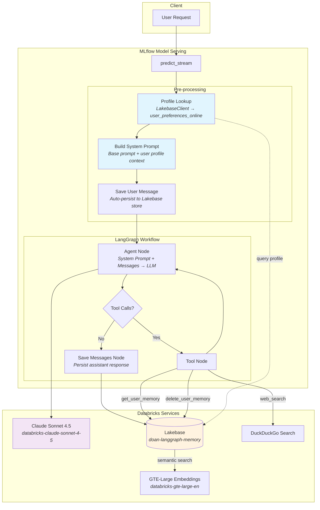
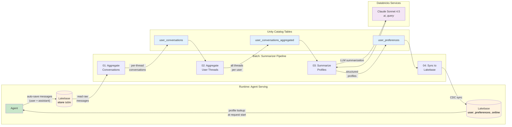

# Stateful LangGraph Agent with Long-Term Memory

A Databricks-native AI agent that remembers users across conversations. Built with LangGraph and MLflow's `ResponsesAgent` interface, the agent persists every conversation to Databricks Lakebase and uses a batch summarization pipeline to build rich user profiles that personalize future interactions.

## Architecture

### Agent Architecture



### Data Flow: Memory → Summarization → Personalization

This diagram shows the complete lifecycle of how conversations flow from the agent into long-term memory, get summarized into user profiles, and feed back into the agent as personalization context.



### User Profile Schema

The summarizer pipeline produces structured profiles with the following fields:

| Field | Type | Description |
|-------|------|-------------|
| `user_id` | `text` | Lakebase namespace prefix (e.g. `user_memories.ben-doan@databricks-com`) |
| `summary` | `text` | 2-3 sentence user profile |
| `interests` | `jsonb` | List of topics the user has shown interest in |
| `preferences` | `jsonb` | List of stated or inferred preferences |
| `behavioral_notes` | `jsonb` | List of notable interaction patterns |
| `total_messages` | `bigint` | Total message count across all threads |
| `thread_count` | `bigint` | Number of conversation threads |
| `last_conversation_at` | `timestamp` | Most recent interaction |

## Project Structure

```
├── agent/
│   ├── agent.py          # LangGraph agent with ResponsesAgent interface
│   ├── config.yaml       # Agent configuration (LLM, embeddings, Lakebase, tools)
│   ├── deploy.py         # MLflow logging + Model Serving deployment
│   └── driver.py         # Local testing notebook
├── user_summarizer/
│   ├── config.yaml       # Pipeline configuration (tables, LLM, sync settings)
│   ├── 01_aggregate_conversations.py   # Store → per-thread conversations
│   ├── 02_aggregate_user_threads.py    # Per-thread → per-user aggregation
│   ├── 03_summarize_user_profiles.py   # LLM-powered profile extraction
│   └── 04_create_synced_table.py       # UC table → Lakebase synced table
├── databricks.yml        # Databricks Asset Bundle definition
├── requirements.txt      # Python dependencies
└── CLAUDE.md             # Development guidance
```

## How It Works

### Agent Memory System

Every conversation is automatically persisted to Lakebase under a user-scoped namespace:

1. **Namespace**: `("user_memories", user_id.replace(".", "-"))` — e.g. `ben.doan@databricks.com` becomes `user_memories.ben-doan@databricks-com`
2. **Key format**: `{thread_id}-{role}` — each message is stored with its thread and role
3. **Semantic search**: The `get_user_memory` tool searches stored memories using vector embeddings (GTE-Large, 1024 dims) for relevant context retrieval

### Profile-Augmented System Prompt

At the start of each request, the agent:

1. Looks up the user's profile from the `user_preferences_online` Lakebase table
2. Appends a `## User Profile Context` section to the system prompt with the user's summary, interests, preferences, and behavioral notes
3. Instructs the LLM to use this context implicitly without volunteering it unprompted

### Summarizer Pipeline

The batch pipeline (run periodically) processes raw conversation data into structured profiles:

| Step | Input | Output | Description |
|------|-------|--------|-------------|
| 01 | `store` (Lakebase) | `user_conversations` (UC) | Parse messages, group by user+thread, concatenate chronologically |
| 02 | `user_conversations` | `user_conversations_aggregated` (UC) | Combine all threads per user with thread markers |
| 03 | `user_conversations_aggregated` | `user_preferences` (UC) | Extract interests, preferences, behavioral notes via `ai_query()` |
| 04 | `user_preferences` (UC) | `user_preferences_online` (Lakebase) | Create CDC-synced table for low-latency agent reads |

## Setup

### Prerequisites

- Databricks workspace with Model Serving enabled
- Lakebase instance (configured as `doan-langgraph-memory`)
- Model serving endpoints: `databricks-claude-sonnet-4-5`, `databricks-gte-large-en`
- Unity Catalog schema: `doan.stateful_agent`

### Install Dependencies

```bash
pip install -r requirements.txt
```

### Local Development

The agent and pipeline notebooks use Databricks Connect for local execution:

```bash
# Test the agent locally
python agent/driver.py

# Run the summarizer pipeline
python user_summarizer/01_aggregate_conversations.py
python user_summarizer/02_aggregate_user_threads.py
python user_summarizer/03_summarize_user_profiles.py
python user_summarizer/04_create_synced_table.py
```

### Deployment

Deploy to Databricks Model Serving using the deploy notebook:

```bash
# Via Databricks Asset Bundles
databricks bundle deploy -t dev

# Or run the deployment notebook directly
python agent/deploy.py
```

The deployment registers the agent in Unity Catalog as `doan.stateful_agent.stateful_langgraph_agent` and creates a Model Serving endpoint.

## Configuration

### Agent (`agent/config.yaml`)

| Key | Description |
|-----|-------------|
| `llm.endpoint_name` | Model serving endpoint for the LLM |
| `llm.system_prompt` | Base system prompt for the agent |
| `lakebase.instance_name` | Lakebase instance for memory storage |
| `embeddings.endpoint` | Embedding model for semantic search |
| `embeddings.dims` | Embedding dimensions |
| `tools.uc_function_names` | Unity Catalog functions to expose as tools |
| `user_profiles.table` | Lakebase table for user profile lookups |

### Summarizer (`user_summarizer/config.yaml`)

| Key | Description |
|-----|-------------|
| `store_table` | Lakebase store table coordinates (catalog.schema.name) |
| `unity_catalog` | Output table names for each pipeline stage |
| `summarizer.llm_endpoint_name` | LLM endpoint for profile summarization |
| `summarizer.prompt` | Prompt template for extracting user profiles |
| `lakebase` | Synced table configuration for low-latency reads |
