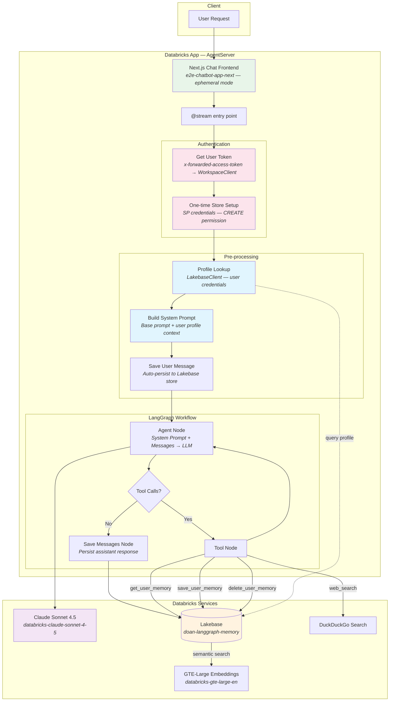
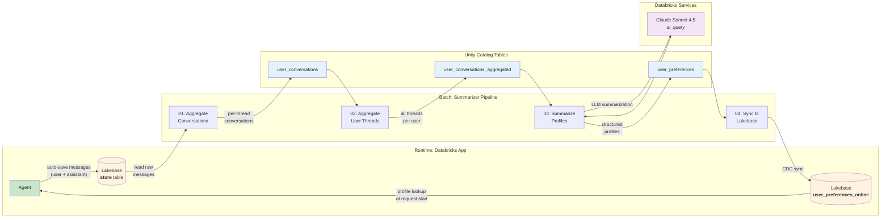

# Stateful LangGraph Agent with Long-Term Memory

A Databricks-native AI agent that remembers users across conversations. Built with LangGraph and MLflow's `AgentServer` interface, the agent persists every conversation to Databricks Lakebase and uses a batch summarization pipeline to build rich user profiles that personalize future interactions. Deploys as a **Databricks App** with a Next.js chat frontend.

## Architecture

### Agent Architecture



### Data Flow: Memory → Summarization → Personalization

This diagram shows the complete lifecycle of how conversations flow from the agent into long-term memory, get summarized into user profiles, and feed back into the agent as personalization context.



### User Profile Schema

The summarizer pipeline produces structured profiles with the following fields:

| Field | Type | Description |
|-------|------|-------------|
| `user_id` | `text` | Lakebase namespace prefix (e.g. `user_memories.ben-doan@databricks-com`) |
| `summary` | `text` | 2-3 sentence user profile |
| `interests` | `jsonb` | List of topics the user has shown interest in |
| `preferences` | `jsonb` | List of stated or inferred preferences |
| `behavioral_notes` | `jsonb` | List of notable interaction patterns |
| `total_messages` | `bigint` | Total message count across all threads |
| `thread_count` | `bigint` | Number of conversation threads |
| `last_conversation_at` | `timestamp` | Most recent interaction |

## Project Structure

```
├── agent_server/              # Agent backend (Databricks Apps)
│   ├── __init__.py
│   ├── agent.py               # @invoke/@stream + async LangGraph graph
│   ├── evaluate_agent.py      # Agent evaluation with MLflow scorers
│   ├── start_server.py        # AgentServer bootstrap with chat proxy
│   ├── utils.py               # Stream processing + OBO auth helpers
│   └── utils_memory.py        # Async memory tools + profile lookup
├── scripts/                   # CLI tools and app startup
│   ├── __init__.py
│   ├── start_app.py           # Launches backend + frontend concurrently
│   ├── quickstart.py          # Interactive setup (auth, experiment, Lakebase)
│   └── discover_tools.py      # Discover UC functions, tables, indexes, MCP servers
├── test_notebooks/            # Testing
│   └── test_app.py            # Databricks notebook to test deployed app
├── agent_archive/             # Old Model Serving deployment (reference only)
│   ├── agent.py               # Original ResponsesAgent class
│   ├── config.yaml            # Original config
│   ├── deploy.py              # MLflow logging + Model Serving deployment
│   └── driver.py              # Local testing notebook
├── user_summarizer/           # Batch summarization pipeline
│   ├── config.yaml            # Pipeline configuration
│   ├── 01_aggregate_conversations.py
│   ├── 02_aggregate_user_threads.py
│   ├── 03_summarize_user_profiles.py
│   └── 04_create_synced_table.py
├── app.yaml                   # Databricks Apps runtime config
├── pyproject.toml             # Dependencies + entry points
├── databricks.yml             # Databricks Asset Bundle definition
├── .env.example               # Local dev environment template
└── requirements.txt           # Python dependencies
```

## Quickstart

```bash
# Install uv
pip install uv

# Run the interactive quickstart (sets up auth, MLflow experiment, Lakebase)
uv run quickstart

# Start the app locally (backend + frontend)
uv run start-app
```

The quickstart script handles:
- Checking prerequisites (uv, Node.js, Databricks CLI)
- Databricks OAuth authentication
- MLflow experiment creation
- Lakebase instance configuration
- `.env` file setup

## CLI Commands

| Command | Description |
|---------|-------------|
| `uv run quickstart` | Interactive setup wizard |
| `uv run start-app` | Launch backend + frontend together |
| `uv run start-server` | Launch backend only (port 8000) |
| `uv run agent-evaluate` | Run agent evaluation with MLflow scorers |
| `uv run discover-tools` | Discover available UC functions, tables, indexes, MCP servers |

## How It Works

### Agent Memory System

Every conversation is automatically persisted to Lakebase under a user-scoped namespace:

1. **Namespace**: `("user_memories", user_id.replace(".", "-"))` — e.g. `ben.doan@databricks.com` becomes `user_memories.ben-doan@databricks-com`
2. **Key format**: `{thread_id}-{role}` — each message is stored with its thread and role
3. **Semantic search**: The `get_user_memory` tool searches stored memories using vector embeddings (GTE-Large, 1024 dims) for relevant context retrieval

### Profile-Augmented System Prompt

At the start of each request, the agent:

1. Looks up the user's profile from the `user_preferences_online` Lakebase table
2. Appends a `## User Profile Context` section to the system prompt with the user's summary, interests, preferences, and behavioral notes
3. Instructs the LLM to use this context implicitly without volunteering it unprompted

### Authentication & Lakebase Credentials

The agent uses a two-tier authentication model for Lakebase access:

**On-Behalf-Of-User (OBO) — Deployed App**

When deployed as a Databricks App with [User Authorization](https://docs.databricks.com/aws/en/dev-tools/databricks-apps/auth) enabled, the Databricks Apps proxy injects an `x-forwarded-access-token` header containing the end user's OAuth token. The agent uses this token to create a `WorkspaceClient` that authenticates to Lakebase as the user, not the app's service principal.

```
User Request → Databricks Apps Proxy → x-forwarded-access-token header
                                        ↓
                              get_user_workspace_client()
                                        ↓
                              WorkspaceClient(host=..., token=user_token)
                                        ↓
                    ┌───────────────────┴───────────────────┐
                    ↓                                       ↓
        AsyncDatabricksStore(                   LakebaseClient(
          workspace_client=user_client)           workspace_client=user_client)
        → read/write memories                   → query user_preferences_online
```

The `AsyncDatabricksStore` and `LakebaseClient` use the workspace client to:
1. Resolve the Lakebase instance DNS via `database.get_database_instance()`
2. Derive the PostgreSQL username via `current_user.me()`
3. Mint rotating OAuth tokens via `database.generate_database_credential()` for PostgreSQL password auth

**Store Table Setup — Service Principal**

The `store.setup()` call creates tables (`store_migrations`, item storage) which requires CREATE permission on the `public` schema. End users typically only have READ_WRITE access. To handle this, table setup runs once at startup using the app's default service principal credentials (which have the database resource binding permissions), while per-request operations use the user's OBO token:

```python
# One-time setup with SP credentials (CREATE permission)
await _ensure_store_setup()

# Per-request with user credentials (READ_WRITE permission)
async with AsyncDatabricksStore(..., workspace_client=user_client) as store:
    ...
```

**Local Development Fallback**

When running locally, the `x-forwarded-access-token` header doesn't exist. `get_user_workspace_client()` falls back to `WorkspaceClient()` which uses default credentials from `.env` (PAT or CLI profile).

**Prerequisites for OBO**

User Authorization is a Public Preview feature that requires workspace admin setup:
1. Enable User Authorization in workspace Admin Settings
2. Add OAuth scopes to the app (e.g., `all-apis`, `offline_access`)
3. Restart the app after enabling
4. Users see a one-time consent prompt on first access

**Frontend Database Isolation**

The `start_app.py` script strips `PG*` and `POSTGRES_URL` environment variables from the frontend process. This prevents the Next.js frontend (which includes Drizzle ORM) from attempting database migrations against the shared Lakebase instance. The frontend runs in ephemeral mode — the backend handles all persistence.

### Frontend

The app includes a Next.js chat frontend (`e2e-chatbot-app-next`) from the [Databricks app-templates](https://github.com/databricks/app-templates) repository. The `start-app` script automatically clones, builds, and runs it alongside the backend. The AgentServer proxies frontend requests through port 8000 via `enable_chat_proxy=True`.

### Summarizer Pipeline

The batch pipeline (run periodically) processes raw conversation data into structured profiles:

| Step | Input | Output | Description |
|------|-------|--------|-------------|
| 01 | `store` (Lakebase) | `user_conversations` (UC) | Parse messages, group by user+thread, concatenate chronologically |
| 02 | `user_conversations` | `user_conversations_aggregated` (UC) | Combine all threads per user with thread markers |
| 03 | `user_conversations_aggregated` | `user_preferences` (UC) | Extract interests, preferences, behavioral notes via `ai_query()` |
| 04 | `user_preferences` (UC) | `user_preferences_online` (Lakebase) | Create CDC-synced table for low-latency agent reads |

## Setup

### Prerequisites

- Databricks workspace with Apps support
- Lakebase instance (configured as `doan-langgraph-memory`)
- Model serving endpoints: `databricks-claude-sonnet-4-5`, `databricks-gte-large-en`
- Unity Catalog schema: `doan.stateful_agent`
- Node.js 20+ and npm (for the chat frontend)

### Local Development

```bash
# Interactive quickstart (recommended for first-time setup)
uv run quickstart

# Or manual setup:
cp .env.example .env  # fill in DATABRICKS_HOST, DATABRICKS_TOKEN, etc.
uv sync

# Start backend + frontend together
uv run start-app

# Or start backend only
uv run start-server
# Backend runs on http://localhost:8000

# Test with curl
curl -X POST http://localhost:8000/invocations \
  -H "Content-Type: application/json" \
  -d '{
    "input": [{"type": "message", "role": "user", "content": "hello"}],
    "context": {"user_id": "ben.doan@databricks.com"},
    "custom_inputs": {"thread_id": "test-001"}
  }'
```

### Evaluation

```bash
uv run agent-evaluate
```

Runs the agent against a test dataset using MLflow's `RelevanceToQuery` and `Safety` scorers. Edit `agent_server/evaluate_agent.py` to customize the evaluation dataset and scorers.

### Tool Discovery

```bash
# Discover all available tools and data sources
uv run discover-tools

# Filter by catalog
uv run discover-tools --catalog my_catalog

# Output as JSON
uv run discover-tools --format json --output tools.json
```

### Deployment

Deploy as a Databricks App:

```bash
# Deploy with Databricks Asset Bundles
databricks bundle deploy -t dev

# Or sync and deploy manually
databricks sync . /Workspace/Users/<user>/stateful-agents-demo
databricks apps deploy stateful-agent-app \
  --source-code-path /Workspace/Users/<user>/stateful-agents-demo
```

The app configuration in `databricks.yml` binds the Lakebase instance and MLflow experiment as managed resources.

**Important:** `LAKEBASE_INSTANCE_NAME` is set as a static `value` (not `valueFrom`) in `app.yaml` and `databricks.yml`. The `valueFrom: "database"` binding injects the PGHOST DNS hostname, but `AsyncDatabricksStore` requires the logical instance name to resolve the instance via the Databricks API. The `database` resource binding is still declared for permission grants.

**Enabling User Authorization (required for OBO auth):**

1. Ask a workspace admin to enable User Authorization (Public Preview) in Admin Settings
2. Add OAuth scopes to the app:
   ```bash
   databricks account custom-app-integration update '<APP_ID>' --json \
     '{"scopes": ["offline_access", "all-apis"]}'
   ```
3. Restart the deployed app
4. On first access, users will see a consent prompt to authorize the app

### Testing the Deployed App

Upload `test_notebooks/test_app.py` to your Databricks workspace and run it. It uses the Databricks SDK to authenticate and send test messages to the deployed app.

## Configuration

### Environment Variables (`app.yaml` / `.env`)

| Variable | Description |
|----------|-------------|
| `LAKEBASE_INSTANCE_NAME` | Lakebase instance for memory storage |
| `MLFLOW_EXPERIMENT_ID` | MLflow experiment ID for tracing |
| `MLFLOW_TRACKING_URI` | Set to `databricks` for Databricks-hosted tracking |
| `DATABRICKS_CONFIG_PROFILE` | Databricks CLI profile (local dev) |
| `API_PROXY` | Backend URL for frontend proxy (default: `http://localhost:8000/invocations`) |
| `CHAT_APP_PORT` | Frontend port (default: `3000`) |

### Agent Constants (`agent_server/agent.py`)

| Constant | Value | Description |
|----------|-------|-------------|
| `LLM_ENDPOINT_NAME` | `databricks-claude-sonnet-4-5` | Model serving endpoint for the LLM |
| `EMBEDDING_ENDPOINT` | `databricks-gte-large-en` | Embedding model for semantic search |
| `EMBEDDING_DIMS` | `1024` | Embedding dimensions |
| `SYSTEM_PROMPT` | (see code) | Base system prompt for the agent |
| `UC_TOOL_NAMES` | `[]` | Unity Catalog functions to expose as tools |

### Summarizer (`user_summarizer/config.yaml`)

| Key | Description |
|-----|-------------|
| `store_table` | Lakebase store table coordinates (catalog.schema.name) |
| `unity_catalog` | Output table names for each pipeline stage |
| `summarizer.llm_endpoint_name` | LLM endpoint for profile summarization |
| `summarizer.prompt` | Prompt template for extracting user profiles |
| `lakebase` | Synced table configuration for low-latency reads |
